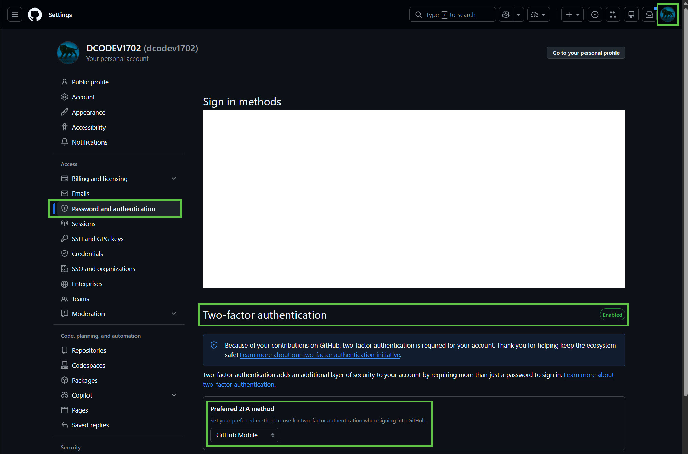
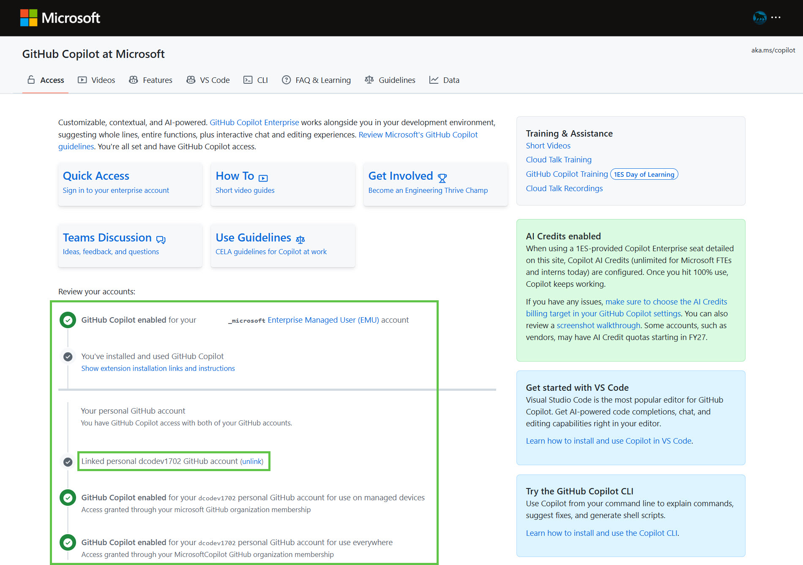
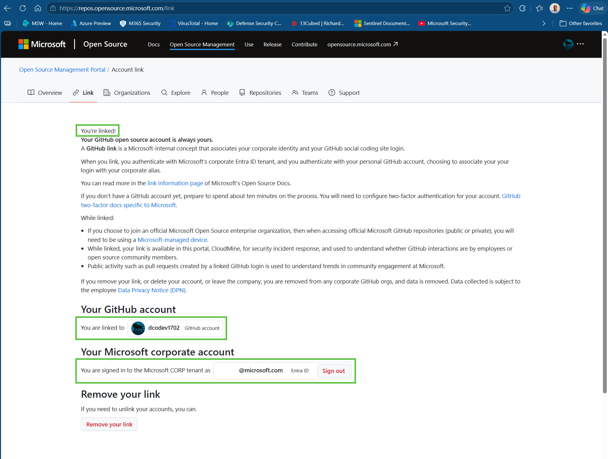
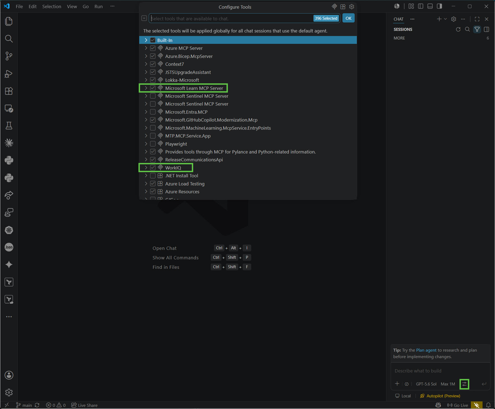
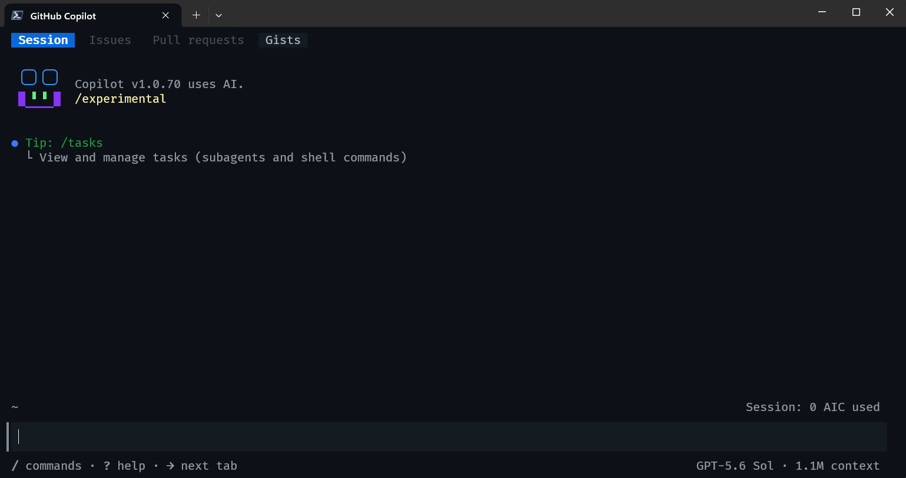
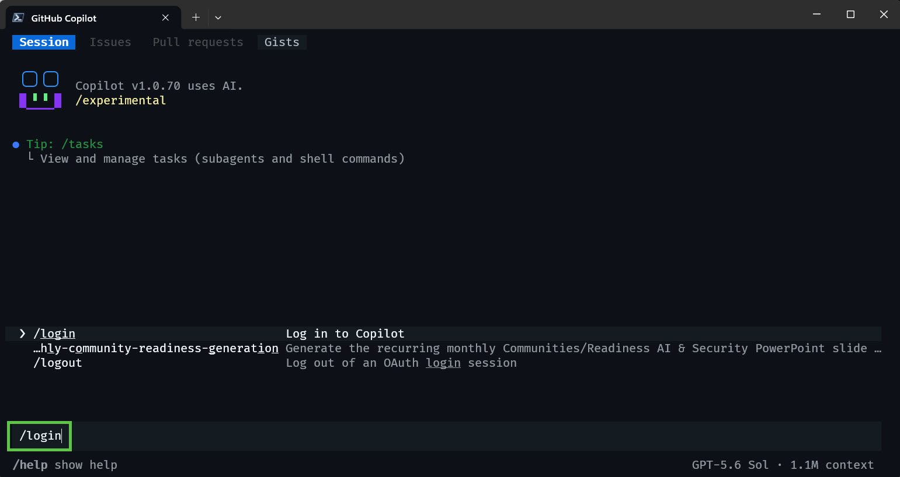

# 🏆 GitHub Copilot Enterprise and CLI for Microsoft FTEs

This beginner-friendly guide walks Microsoft full-time employees (FTEs) through linking a GitHub Copilot Enterprise license, signing in to the **GitHub Copilot app**, **Visual Studio Code**, and **GitHub Copilot CLI**, and adding trusted **Model Context Protocol (MCP) servers** for tool-backed assistance.

> [!NOTE]
> Last verified: **July 15, 2026**. Product interfaces, available models, and enterprise policies change over time. When the guide and the product differ, follow the current product prompt and linked official documentation.

## Before You Start

You need:

- A Windows 10 or Windows 11 computer, or access to a Microsoft Dev Box.
- Your Microsoft corporate identity and access to the internal account-linking sites used in section 2.
- A personal GitHub account. You can create one in section 1 if needed.
- Permission to install software. Some managed devices might require administrator approval.
- Windows Package Manager (`winget`). Run `winget --version` in a terminal to confirm it is available.

Optional: [join the Microsoft AI community](https://aka.ms/garage/skillupai/viva) for peer support and events.

## Contents
<!-- no toc -->
- [Before You Start](#before-you-start)
- [Contents](#contents)
- [Optional: Use a Microsoft Dev Box](#optional-use-a-microsoft-dev-box)
- [1. Install PowerShell, VS Code, and Create a GitHub Account](#1-install-powershell-vs-code-and-create-a-github-account)
- [2. Set Up Your GitHub Copilot Enterprise License](#2-set-up-your-github-copilot-enterprise-license)
- [3. Install the GitHub Copilot App](#3-install-the-github-copilot-app)
- [4. Connect GitHub Copilot to VS Code](#4-connect-github-copilot-to-vs-code)
- [5. Configure MCP Servers](#5-configure-mcp-servers)
- [6. Install and Use GitHub Copilot CLI](#6-install-and-use-github-copilot-cli)
- [7. Explore GitHub Copilot CLI](#7-explore-github-copilot-cli)
- [8. Join the Microsoft AI Community](#8-join-the-microsoft-ai-community)
- [9. Product Maker AI Workspace](#9-product-maker-ai-workspace)
- [Valuable Resources](#valuable-resources)

---

## Optional: Use a Microsoft Dev Box

If your personal hardware is older, storage-constrained, or already working hard during GenAI-assisted workflows, consider setting up a Microsoft Dev Box before starting this guide. A Dev Box gives you an "always on" cloud workstation where VS Code, GitHub Copilot, terminal sessions, MCP servers, and automation can run without taxing your local CPU, memory, storage, or battery. Because the workspace lives in the cloud, it can meet you wherever you have an Internet connection, whether you connect from your laptop, another device, the Windows App, or a browser.

Start here: [Microsoft Dev Box Enablement Guide](devbox-enablement.md)

---

## 1. Install PowerShell, VS Code, and Create a GitHub Account

### Install PowerShell 7

Run this command from Windows Terminal:

```powershell
# Install PowerShell 7 (silently / non-interactive)
winget install --id Microsoft.PowerShell --exact --source winget --silent --accept-package-agreements --accept-source-agreements
```

> [!IMPORTANT]
> After PowerShell 7 has been installed, be sure to completely close 'Terminal' and open it back up again, otherwise you will not see the option to select 'PowerShell'

Set **PowerShell 7** in your default profile: **Windows Terminal** → **Settings** → **Default profile** → select **PowerShell** → **Save**.


### Install Visual Studio Code

```powershell
# Install VS Code (silently / non-interactively)
winget install --id Microsoft.VisualStudioCode --exact --source winget --silent --accept-package-agreements --accept-source-agreements
```

### Secure Your Personal GitHub Account

> [!IMPORTANT]
> Keep your personal GitHub account secure with a strong password and either two-factor authentication (2FA) or a passkey. Linking this personal GitHub account to your Microsoft corporate identity is required for the FTE licensing workflow in section 2.

Create a [personal GitHub account](https://github.com/) if you do not already have one, then:

- Optionally install GitHub Mobile on your mobile device and sign in.
- Enable 2FA: **GitHub profile → Settings → Password and authentication → Enable 2FA**.
- Choose your preferred authentication method and store your recovery codes securely. See the [GitHub 2FA documentation](https://docs.github.com/en/authentication/securing-your-account-with-two-factor-authentication-2fa).



> [!TIP]
> **Done when:** `pwsh --version` and `code --version` both return installed versions, and your personal GitHub account has 2FA or a passkey configured.

---

## 2. Set Up Your GitHub Copilot Enterprise License

> [!CAUTION]
> This is the **critical step** in the Microsoft FTE - Enterprise GHCP workflow.



### Link Your Microsoft and GitHub Accounts

1. Open the [Microsoft GitHub Copilot account-linking site](https://copilot.github.microsoft.com/).
1. Sign in with your Microsoft corporate identity when prompted.
1. Link the personal GitHub account that you secured in section 1.
1. Open the [Microsoft Open Source portal](https://repos.opensource.microsoft.com/link) and confirm that the accounts are linked.



In GitHub, open **Profile → Settings → Billing and licensing → Licensing** and confirm that your Copilot Enterprise license appears.


For more help, follow the [Microsoft walkthrough for GitHub Copilot and VS Code](https://github.com/mcaps-microsoft/Getting-Started-with-GitHub-Copilot-and-VSCode/blob/main/Getting_Started_with_GitHub_Copilot_and_VSCode.md).

> [!TIP]
> **Done when:** the Open Source portal confirms the account link and GitHub shows an active Copilot Enterprise license.

---

## 3. Install the GitHub Copilot App

The [GitHub Copilot app](https://github.com/features/ai/github-app) gives you a dedicated desktop experience for GitHub Copilot outside the browser and VS Code.

1. Go to the [GitHub Copilot app download page](https://github.com/features/ai/github-app).
1. Download and install the app for your operating system.
1. Open the app and sign in with the **personal GitHub account** linked to your Microsoft corporate identity.
1. Confirm that Copilot recognizes your Enterprise license and displays a model selector.


> [!TIP]
> **Done when:** the app accepts your linked personal GitHub account and can start a Copilot session. If the license is not recognized, return to the [account-linking site](https://copilot.github.microsoft.com/) and confirm eligibility.

---

## 4. Connect GitHub Copilot to VS Code

### Sign In to VS Code

1. In VS Code, open **Accounts** (person icon) → sign in.
1. Sign in using the **personal GitHub account** linked to your Microsoft corporate identity.


### Verify Copilot Chat and the Model Selector

1. Open the **GitHub Copilot Chat** panel from the chat icon near the top of VS Code.
1. Open the model selector and confirm that it lists at least one model approved by your organization.
1. Send a simple prompt, such as `Explain what you can help me do in this workspace.`


The exact model list varies by plan, enterprise policy, region, and rollout date. Seeing the model selector and at least one approved model is the reliable success criterion; the screenshot is illustrative.

> [!TIP]
> **Done when:** Copilot Chat answers a prompt and the model selector shows at least one model available to your account.

---

## 5. Configure MCP Servers

MCP is an open standard that connects an AI model to external tools and data sources. In this guide, Microsoft Learn and Context7 provide documentation, WorkIQ connects Microsoft FTEs to authorized Microsoft 365 work context, and Playwright can navigate and interact with web pages.

> [!WARNING]
> An MCP server is code or a remote service that Copilot can call on your behalf. A local `stdio` server runs with your user permissions, and a remote server can receive data included in tool requests. Install only servers from publishers you trust and review the package name, command, URL, and available tools before approval. WorkIQ can access Microsoft 365 work data permitted by your identity and tenant policy; use its results according to Microsoft data-handling requirements. Packages referenced with `@latest` can change, so pin a tested version when repeatability matters.

### Recommended: Configure MCP with Copilot Chat

Paste the following prompt into Copilot Chat. It requires Copilot to explain security-sensitive actions and validate each server rather than silently editing configuration files.

```text
Use this README as the setup guide:
https://github.com/dcodev1702/GitHub-Copilot-How-To/blob/main/README.md

Start from section 5 and work one step at a time.

1. Verify Node.js LTS and Git for Windows, and offer to install missing tools.
2. Ask before running an elevated command.
3. Use the VS Code MCP gallery or MCP commands instead of hard-coded paths.
4. Configure Microsoft Learn, keyless Context7, and WorkIQ by default.
5. After Copilot CLI /login, immediately start WorkIQ authentication with
  npx -y @microsoft/workiq auth login. Use my Microsoft corporate identity
  through Microsoft Entra ID. Use Windows Web Account Manager or browser
  authentication, never device-code authentication.
6. Show me the WorkIQ EULA and ask me to accept it; do not accept it for me.
7. If WorkIQ requires tenant admin consent, stop and show me the official
  tenant administrator enablement guide.
8. Treat Playwright as optional. Before adding any local server,
   show me its publisher, package, command, URL, and requested tools.
9. Never ask me to paste a secret into chat or write one directly into JSON.
10. Validate each server, show its tools, and report any startup errors.

Do not configure Product Maker AI Workspace in section 9.
```


### Install or Verify the MCP Prerequisites

Use the LTS release of Node.js. Avoid hard-coding the numbered "Current" release in setup instructions because its support status changes frequently.

1. Install [Node.js LTS](https://nodejs.org/en):

   ```powershell
   winget install --id OpenJS.NodeJS.LTS --exact --source winget --silent --accept-package-agreements --accept-source-agreements
   ```

1. Install [Git for Windows](https://git-scm.com/install/windows):

   ```powershell
   winget install --id Git.Git --exact --source winget --silent --accept-package-agreements --accept-source-agreements
   ```

1. Close and reopen the terminal, then verify both tools:

   ```powershell
   node --version
   npm --version
   git --version
   ```

A Context7 API key is optional and provides higher rate limits. Start without one. If you later need a key, create it in the [Context7 dashboard](https://context7.com/dashboard), keep it out of chat and source control, and use the secure VS Code input described below.

### Authenticate WorkIQ with Microsoft Entra ID

WorkIQ and GitHub Copilot use separate identities. GitHub Copilot signs in with the linked personal GitHub account, while WorkIQ signs in to Microsoft 365 through Microsoft Entra ID with your Microsoft corporate identity.

1. Review the [WorkIQ license terms](https://github.com/microsoft/work-iq) and explicitly accept the EULA:

  ```powershell
  npx -y @microsoft/workiq accept-eula
  ```

1. Start the WorkIQ Microsoft Entra ID sign-in:

  ```powershell
  npx -y @microsoft/workiq auth login
  ```

1. Select your Microsoft corporate account. On Windows, WorkIQ 1.0 uses Windows Web Account Manager (WAM) and falls back to browser-based Entra authentication when needed.
1. If an administrator-consent dialog appears, follow the official [WorkIQ tenant administrator enablement guide](https://github.com/microsoft/work-iq/blob/main/ADMIN-INSTRUCTIONS.md). If you are not a tenant administrator, send that guide to your administrator rather than attempting another authentication method.

> [!IMPORTANT]
> Do not use device-code authentication or paste tokens into chat or configuration files. WorkIQ caches the Entra authentication for its CLI and MCP server. Conditional Access and tenant consent policies still apply.

### Add MCP Servers in VS Code

The product commands account for VS Code profiles, remote sessions, and Dev Boxes more reliably than navigating to a hard-coded Windows path.

1. Open the Extensions view and search for `@mcp` to browse the MCP gallery. Review the publisher before installing a server such as Playwright.
1. Run **MCP: Add Server** from the Command Palette to add a server through a guided flow.
1. Run **MCP: Open User Configuration** to inspect the profile-specific `mcp.json` file. Choose user configuration for all workspaces or `.vscode/mcp.json` only when the configuration should be shared with one trusted repository.



For manual setup, the following is a keyless, user-level starting configuration:

```json
{
  "servers": {
    "playwright": {
      "type": "stdio",
      "command": "npx",
      "args": ["-y", "@playwright/mcp@latest"]
    },
    "workIQ": {
      "type": "stdio",
      "command": "npx",
      "args": ["-y", "@microsoft/workiq", "mcp"]
    },
    "context7": {
      "type": "http",
      "url": "https://mcp.context7.com/mcp"
    },
    "microsoftLearn": {
      "type": "http",
      "url": "https://learn.microsoft.com/api/mcp"
    }
  },
  "inputs": []
}
```

> [!NOTE]
> VS Code uses a top-level `servers` object. GitHub Copilot CLI uses `mcpServers`; do not copy one product's complete configuration file over the other.

#### Optional: Add a Context7 Key Securely in VS Code

Replace the `context7` server object with this version:

```json
{
  "type": "http",
  "url": "https://mcp.context7.com/mcp",
  "headers": {
    "CONTEXT7_API_KEY": "${input:context7-api-key}"
  }
}
```

Then replace the top-level `"inputs": []` value with this array:

```json
[
  {
    "type": "promptString",
    "id": "context7-api-key",
    "description": "Context7 API key",
    "password": true
  }
]
```

VS Code prompts for the key when the server starts and stores it securely. Do not replace the input variable with the literal key.

### Validate MCP in VS Code

1. Run **MCP: List Servers** from the Command Palette.
1. Start each server individually. Review its configuration and tools before confirming trust.
1. If a server fails, select **Show Output** and resolve the reported startup or authentication error.
1. In Copilot Chat, select **Configure Tools** and leave unnecessary tools disabled.
1. Test a documentation server with `Find the current VS Code MCP security guidance using Microsoft Learn.`
1. Test WorkIQ with a permitted work-context request, such as `Using WorkIQ, show my next meeting.`

> [!TIP]
> **Done when:** VS Code lists WorkIQ and the documentation servers as running, WorkIQ authenticates with your Microsoft corporate identity, the expected tools are visible, and test prompts return tool-backed responses without exposing a secret.

---

## 6. Install and Use GitHub Copilot CLI

[GitHub Copilot CLI](https://docs.github.com/en/copilot/how-tos/use-copilot-agents/use-copilot-cli) brings agentic assistance, file editing, command execution, and MCP tools into the terminal.



### Confirm Copilot Access

1. Open the [Microsoft GitHub Copilot account-linking site](https://copilot.github.microsoft.com/).
1. Confirm that it recognizes your linked account as eligible for GitHub Copilot.

### Install the CLI with WinGet

Open PowerShell 7 and run:

```powershell
winget install --id GitHub.Copilot --exact --source winget
copilot --version
```

Start the CLI in a folder containing code you trust:

```powershell
copilot
```

To include the optional banner:

```powershell
copilot --banner
```

> [!WARNING]
> Copilot CLI can read, modify, and run files in the current folder and its subfolders after you grant permission. Start it only in a trusted directory, review tool requests, and avoid session-wide approval for destructive or broadly scoped commands.

### Select an Available Model and Sign In

1. Open the current model list:

   ```text
   /model
   ```

1. Choose a model shown as available to your account. Do not rely on a model name copied from a guide; availability varies by policy and changes over time.
1. If prompted, enter `/login` and follow the GitHub sign-in flow with the personal GitHub account linked to your Microsoft corporate identity.

   ```text
   /login
   ```

   

1. Immediately after GitHub sign-in, start the separate WorkIQ Microsoft Entra ID flow if it is not already cached:

  ```powershell
  npx -y @microsoft/workiq auth login
  ```

1. Select your Microsoft corporate account in Windows Web Account Manager or the Entra browser window.

> [!NOTE]
> Copilot CLI owns `/login`, and that slash command authenticates GitHub rather than Microsoft 365. An MCP configuration cannot replace its endpoint. This guide deliberately launches `workiq auth login` immediately afterward so every new setup completes the required Microsoft Entra ID route as the second sign-in.

### Add MCP Servers with CLI Commands

The GitHub MCP server is built into Copilot CLI. Add other servers with `copilot mcp add` so the CLI writes to the correct user configuration location.

Add Microsoft Learn with its three documentation tools:

```powershell
copilot mcp add --transport http --tools "microsoft_docs_search,microsoft_code_sample_search,microsoft_docs_fetch" MicrosoftLearn https://learn.microsoft.com/api/mcp
```

Add Context7 without an API key and enable its two documentation tools:

```powershell
copilot mcp add --transport http --tools "resolve-library-id,query-docs" Context7 https://mcp.context7.com/mcp
```

Add WorkIQ and enable its full tool set for Microsoft FTE workflows:

```powershell
copilot mcp add --tools "*" WorkIQ -- npx -y @microsoft/workiq mcp
```

Optionally add Playwright with a small starter set of browser tools:

```powershell
copilot mcp add --tools "browser_navigate,browser_snapshot,browser_take_screenshot" Playwright -- npx -y @playwright/mcp@latest
```

The WorkIQ command intentionally enables all published WorkIQ tools so the full Microsoft FTE experience is available. The current package includes read and write operations, so after installation or a package update, use `/mcp show WorkIQ` to review the active tools and continue approving consequential actions individually. For other servers, use `/mcp edit SERVER-NAME` to enable only the tools needed for the task.

> [!IMPORTANT]
> Context7 works without a key at lower rate limits. If you add a key through `/mcp edit Context7`, Copilot CLI writes the header to its local `~/.copilot/mcp-config.json` configuration. On Windows, this is normally `%USERPROFILE%\.copilot\mcp-config.json`. Treat that file as sensitive: never commit, sync, paste, or share it, and rotate the key if it is exposed.

#### WorkIQ Authentication and Consent

WorkIQ reuses the cached Microsoft Entra ID session established by `workiq auth login`. If the session expires or a different tenant is required, run the login command again and select the correct corporate account. WorkIQ returns only data allowed by your account and tenant policy, but that data can still be sensitive. Keep work-derived results in approved Microsoft systems and follow the classification and sharing rules that apply to the source content.

### Validate MCP in Copilot CLI

Run these commands outside an interactive session:

```powershell
copilot mcp list
copilot mcp get MicrosoftLearn
copilot mcp get Context7
copilot mcp get WorkIQ
```

Inside an interactive session, use `/mcp show` to inspect status and available tools. Test a documentation server, then ask `Using WorkIQ, show my next meeting` to confirm corporate authentication and Microsoft 365 access.

> [!TIP]
> **Done when:** `copilot --version` succeeds, `/model` shows an available model, WorkIQ has an active Microsoft Entra ID session with any required tenant consent, `copilot mcp list` shows WorkIQ and the documentation servers, and test prompts invoke both a documentation tool and WorkIQ.

---

## 7. Explore GitHub Copilot CLI

- Read the official [GitHub Copilot CLI how-to documentation](https://docs.github.com/en/copilot/how-tos/use-copilot-agents/use-copilot-cli).
- Enter `?` in an interactive session to list slash commands.
- Use plan mode before a complex change and review every proposed command.
- Resume recent work with `copilot --continue` when appropriate.

## 8. Join the Microsoft AI Community

- Join the [Microsoft AI Community of Interest](https://aka.ms/garage/skillupai).
- Watch Scott Hanselman use GitHub Copilot CLI with MCP, Copilot Skills, and [Handy](https://handy.computer/).

---

## 9. Product Maker AI Workspace

Product Maker AI Workspace (PAW) is an advanced, optional workflow that builds on the GitHub Copilot Enterprise setup in this guide.

- Watch the [PAW video how-to](https://aka.ms/pawvideo).

## Valuable Resources

- [Jesse Vincent - **SUPERPOWERS** (supported by Anthropic)](https://github.com/obra/superpowers)
- [Making Windows Terminal Awesome with GitHub Copilot CLI](https://developer.microsoft.com/blog/making-windows-terminal-awesome-with-github-copilot-cli)
- [Awesome Agent Skills from leading development teams and the community](https://github.com/VoltAgent/awesome-agent-skills)
- [Tim Myers - GenAI Spec-Driven Development demos](https://github.com/timothymeyers/sdd-demo-repo)
- [Microsoft Teams MCP reference](https://learn.microsoft.com/en-us/microsoft-agent-365/mcp-server-reference/teams)
- [Microsoft GitHub Copilot SDK](https://github.blog/news-insights/company-news/build-an-agent-into-any-app-with-the-github-copilot-sdk/)
- [Microsoft PowerShell Azure module (Az)](https://learn.microsoft.com/en-us/powershell/azure/new-azureps-module-az?view=azps-15.2.0)
- [Microsoft Graph MCP Server overview](https://learn.microsoft.com/en-us/graph/mcp-server/overview)
- [Microsoft Sentinel data lake MCP overview](https://learn.microsoft.com/en-us/azure/sentinel/datalake/sentinel-mcp-overview)
- [GitHub Copilot documentation](https://docs.github.com/en/copilot)
- [John Saville YouTube channel](https://www.youtube.com/@NTFAQGuy)
- [Azure Friday](https://azurefriday.com/)
