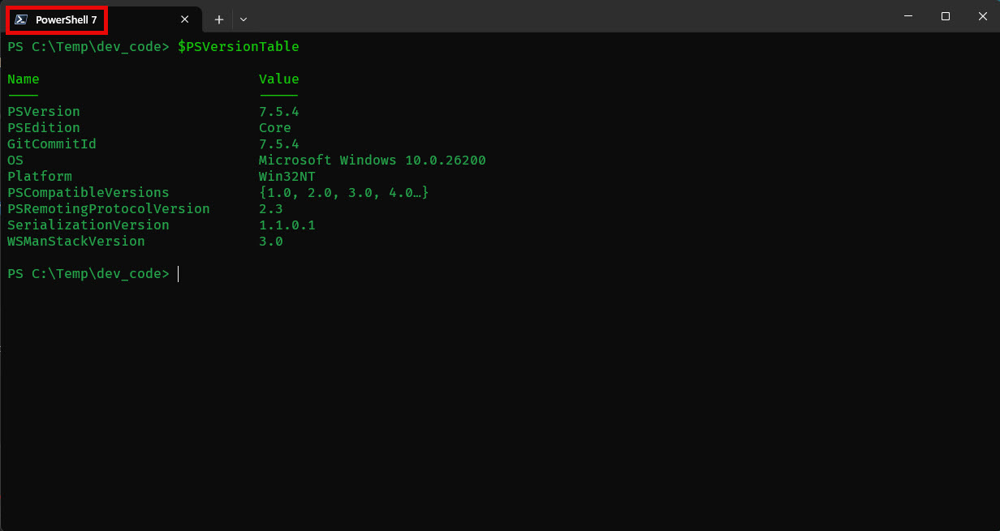
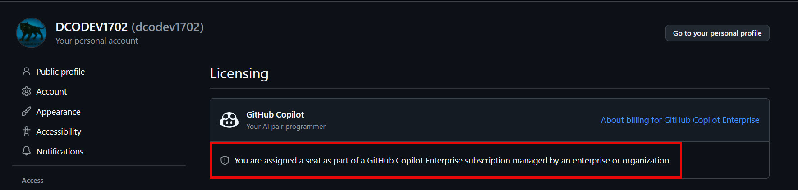
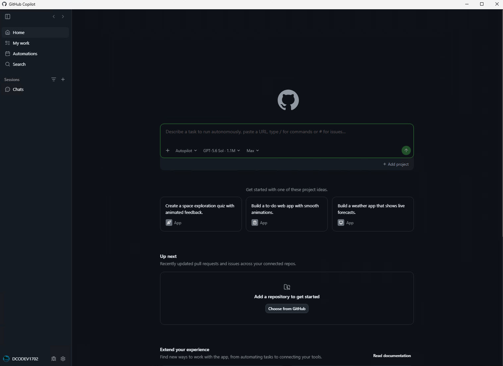
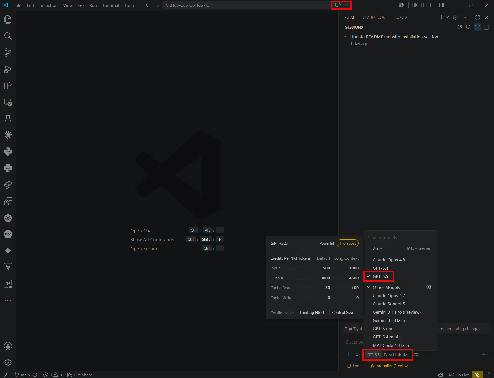
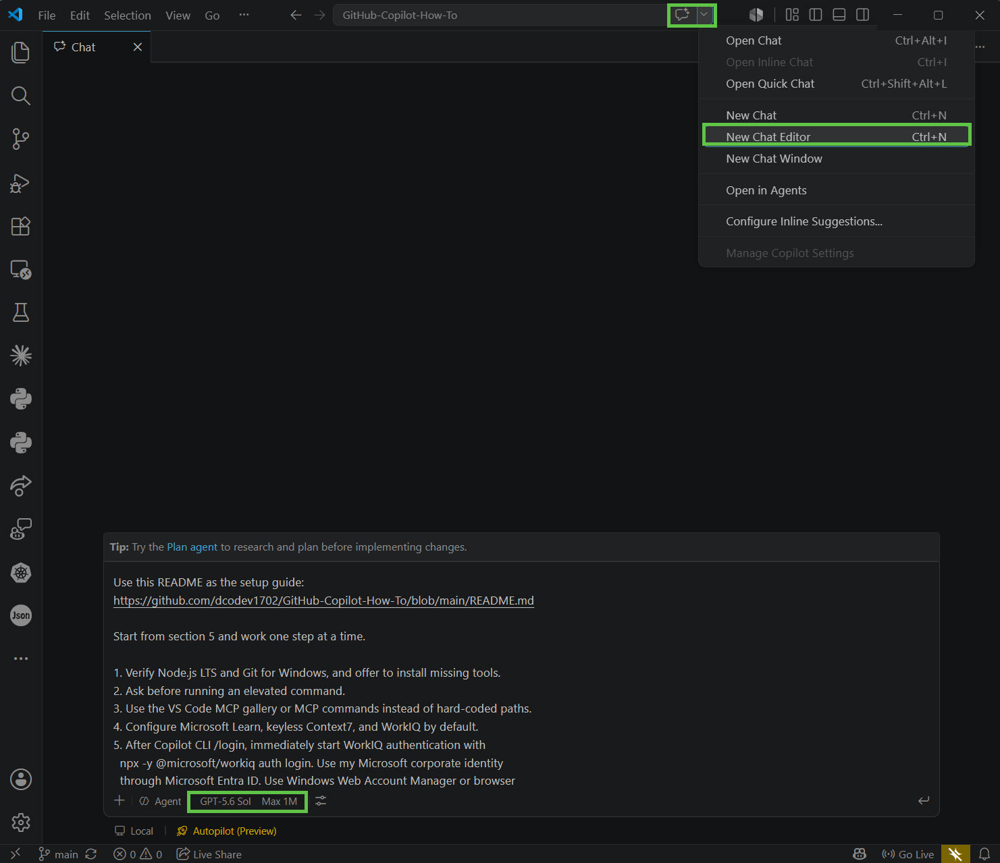
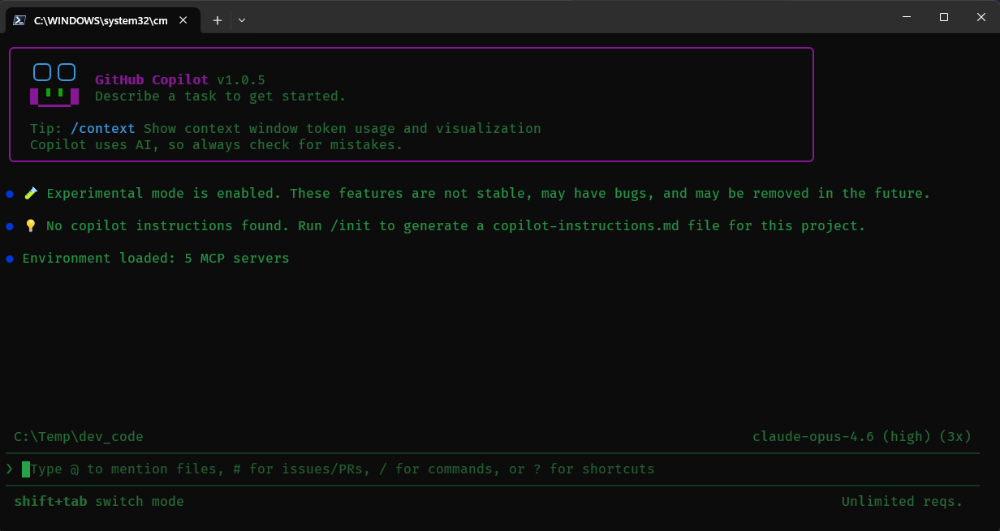

# 🏆 GitHub Copilot Enterprise | GitHub Copilot CLI for Microsoft FTEs

This beginner-friendly guide walks you through setting up your GitHub Copilot Enterprise license and employ the latest frontier models in **VS Code**, **GitHub Copilot Desktop Application**, and **GitHub Copilot CLI** to include, how to configure **MCP servers** (Model Context Protocol) for richer, tool-backed experience.

---

## Install PowerShell 7, Visual Studio Code, and create a personal GitHub (GH) account (if needed)

1. **JOIN THE [COMMUNITY](https://aka.ms/garage/skillupai/viva)** 🔥🔥🔥🔥
		
2. Install **PowerShell 7** from the 🖥️ 'Terminal' (CLI)
   ```powershell
   # Install PowerShell 7 (silently / non-interactive)
   winget install --id Microsoft.PowerShell --source winget --silent --accept-package-agreements --accept-source-agreements
   ```

   * Set **PowerShell 7** as the default profile:
   * Open **Windows Terminal** → **Settings** → **Default profile** → select **PowerShell 7** → **Save**

	

	

3. Install VSCode: https://code.visualstudio.com/
   ```powershell
   # Install VS Code (silently / non-interactively)
   winget install Microsoft.VisualStudioCode --source winget --silent --accept-package-agreements --accept-source-agreements
   ```


> [!IMPORTANT]
> 🔐 Keep your personal GitHub account secure (strong password + 2FA or Passkey) - SFI! </br>
> 🔥 Linking your **personal GitHub account** with your **Microsoft FTE account** is the most critical step in this entire process.

4. Create a GitHub account: https://github.com/
   * Install the GitHub Mobile app on your mobile device. 📱
   * Enable 2FA (two-factor authentication) on your GitHub account.
     * Recommended: configure 2FA so you can approve sign-ins from the mobile app. See the [GitHub 2FA docs](https://docs.github.com/en/authentication/securing-your-account-with-two-factor-authentication-2fa).

---

## 1. Set up GitHub Copilot Enterprise License (Microsoft FTE workflow)

### 🔗 Link your Microsoft corporate identity with your personal GitHub account

‼️ Video How-To: https://aka.ms/pawvideo <br/>

‼️ Link accounts: https://copilot.github.microsoft.com/  <br/>
   * Validate your accounts are linked: https://repos.opensource.microsoft.com/link

**🟢 GITHUB PROFILE → SETTINGS → BILLING/LICENSING → LICENSING: YOU SHOULD SEE THIS 🟢**



> [!NOTE]
> **If additional assistance is required**, follow this walkthrough (VS Code + Copilot setup): <br/>
> https://github.com/mcaps-microsoft/Getting-Started-with-GitHub-Copilot-and-VSCode/blob/main/Getting_Started_with_GitHub_Copilot_and_VSCode.md <br/>

---

## 2. Install the GitHub Copilot Desktop Application

The [GitHub Copilot app](https://github.com/features/ai/github-app) gives you a dedicated desktop experience for GitHub Copilot outside the browser and VS Code.

1. Go to the [GitHub Copilot app download page](https://github.com/features/ai/github-app).
2. Download and install the GitHub Copilot desktop app for your operating system.
3. Open the app and sign in with the **personal GitHub account** that you linked to your Microsoft corporate account.
4. Confirm that Copilot recognizes your Enterprise license and that the model selector is available.



> [!TIP]
> If Copilot does not recognize your license, return to https://copilot.github.microsoft.com/ and confirm your personal GitHub account is linked and eligible.

---


## 3. VS Code integration with GitHub Copilot

### 💻 Sign in to VS Code

1. In VS Code, open **Accounts** (person icon) → sign in.
2. Sign in using the **personal GitHub account** that you linked to your Microsoft corporate account.


---

### Verify GitHub Copilot Chat + model selector

1. Open the **GitHub Copilot Chat** panel (chat icon near the top right, next to the search bar area).
2. You should see multiple Frontier models available (for example: **GPT-5.5**, **Claude Sonnet 5**, **Claude Opus 4.8**, **Gemini 3.1 Pro**, etc.).
3. If you do — CONGRATULATIONS!! 👏👏👏
   * You’re now ready to use GitHub Copilot with latest foundation models.

**🟢 VS CODE: YOU SHOULD SEE THIS 🟢**


---

## 3.5 Use Gen AI to add & configure MCP Servers (GHCP & GHCP CLI)

MCP servers allow GitHub Copilot in VS Code to call trusted tools and retrieve grounded information (docs, browser automation, etc).

### Configure MCP with GitHub Copilot Chat

At this point -- it is far easier to select your desired foundation model and simply PROMPT GitHub Copilot to install the MCP prerequisites, configure your MCP servers, and install GitHub Copilot CLI.

```console
# Provide the PROMPT below, inside GitHub Copilot Chat

Use the following README as the setup guide: https://github.com/dcodev1702/GitHub-Copilot-How-To/blob/main/README.md

Start from section 3.5 of the README.md. Install or verify the MCP prerequisites, including Node.js LTS, Git for Windows, and the Context7 account/API key setup. Then configure MCP servers for GitHub Copilot in VS Code and GitHub Copilot CLI using the JSON examples contained in the README  Validate for correctness and prompt me for elevated authentication as required.
```




### MCP prerequisites the prompt will install or verify

The prompt above should install or verify Node.js and Git, then guide you through Context7 account/API key setup. Use the commands below only if you want to perform the prerequisite setup manually.

1. Install NodeJS: https://nodejs.org/en
   ```powershell
   # Latest LTS (recommended) (silently / non-interactively)
   winget install OpenJS.NodeJS.LTS --source winget --silent --accept-package-agreements --accept-source-agreements
   ```
   Or you can install the latest - Current (25.x)
   ```powershell
   winget install OpenJS.NodeJS --source winget --silent --accept-package-agreements --accept-source-agreements
   ```
2. Install Git for Windows: https://git-scm.com/install/windows
   ```powershell
   winget install --id Git.Git -e --source winget --silent --accept-package-agreements --accept-source-agreements
   ```
3. Create & Obtain Context7 API KEY
   - Go to context7: https://context7.com/ and create an account to obtain an API KEY </br>
   - Be sure to retain your API Key for MCP configuration later on. </br>
   - Sign-Up/Sign-In to Context7 using your account preference (GMail / GitHub)

### MCP Manual Setup (w/o using a prompt)


#### Model Context Protocol (MCP) File path for VS Code

Create or edit this file:

* `C:\Users\%USERNAME%\AppData\Roaming\Code\User\mcp.json`

#### Copy/paste this JSON into `mcp.json`

> [!NOTE]
> The format / structure for mcp.json is **different** than mcp-config.json (GitHub Copilot CLI)
```json
{
    "servers": {
        "playwright": {
            "command": "npx",
            "args": [
                "@playwright/mcp@latest"
            ],
   "type": "stdio"
  },
  "context7": {
   "type": "http",
   "url": "https://mcp.context7.com/mcp",
   "headers": {
    "CONTEXT7_API_KEY": "ADD_YOUR_API_KEY_HERE"
   }
  },
  "Microsoft Learn - MCP": {
   "type": "http",
   "url": "https://learn.microsoft.com/api/mcp",
   "gallery": "https://api.mcp.github.com",
   "version": "1.0.0"
  }
 },
 "inputs": []
}
```

Provide Context7 API KEY
- Replace "ADD_YOUR_API_KEY_HERE" with your actual API Key

Optional next steps (common troubleshooting):

* Restart VS Code after editing `mcp.json`.
* If a server requires Node, install a recent Node.js LTS.
* If a tool requires corporate access (tenant / permissions), it may not work outside your environment.
* 

---

## 4. Install GitHub Copilot CLI

## What can [GitHub Copilot CLI](https://docs.github.com/en/copilot/how-tos/use-copilot-agents/use-copilot-cli) do for you!?



### Confirm Copilot access

1. Go to [Github Copilot](https://copilot.github.microsoft.com/)
2. Confirm it recognizes you as connected/eligible for GitHub Copilot.

### Install GitHub Copilot CLI via winget

Open **PowerShell 7** and run:

```powershell
winget install github.copilot
```

Run **GitHub Copilot CLI**

```powershell
copilot
```

Run **GitHub Copilot CLI w/ the fancy banner 😎**

```powershell
copilot --banner
```

### Sign in and select a model

1. Open the Copilot CLI experience and sign in when prompted.

```text
/login
```


---

2. Select your preferred model. Example (as used in many demos):

```text
/model claude-opus-4.6
```

> [!TIP]
> If you’re not sure which command starts the CLI on your machine, run `copilot --help` after installation and follow the sign-in prompts it provides.

---

### Configure MCP for Copilot CLI

Create or edit this file:

* `C:\Users\%USERNAME%\.copilot\mcp-config.json`

Copy/paste this JSON into `mcp-config.json` (Context7 key omitted):

```json
{
  "mcpServers": {
    "WorkIQ": {
      "command": "npx",
      "args": [
        "-y",
        "@microsoft/workiq",
        "mcp"
      ],
      "tools": ["*"]
    },
    "MicrosoftLearn": {
      "type": "http",
      "url": "https://learn.microsoft.com/api/mcp",
      "tools": ["*"]
    },
    "Playwright": {
      "type": "stdio",
      "command": "npx",
      "args": ["@playwright/mcp@latest"],
      "tools": ["*"]
    },
    "Context7": {
      "type": "http",
      "url": "https://mcp.context7.com/mcp",
      "headers": {
        "CONTEXT7_API_KEY": "ADD_YOUR_API_KEY_HERE"
      },
      "tools": ["*"]
    }
  }
}
```

---

## 5. GitHub Copilot CLI How-To's

* https://docs.github.com/en/copilot/how-tos/use-copilot-agents/use-copilot-cli

## 6. Join the Microsoft AI Community of Interest

* https://aka.ms/garage/skillupai
* Watch Scott Hanselman harness the power of GitHub Copilot CLI w/ MCP and Copilot Skills & [Handy](https://handy.computer/)

---

## Valuable Resources

* [Jesse Vincent - **SUPERPOWERS** (supported by Anthropic (Claude))](https://github.com/obra/superpowers)
* [Making Windows Terminal Awesome w/ GitHub Copilot CLI](https://developer.microsoft.com/blog/making-windows-terminal-awesome-with-github-copilot-cli)
* [Awesome Agent Skills from leading Dev teams & Community](https://github.com/VoltAgent/awesome-agent-skills)
* [Tim Myers - GenAI Spec Driven Development (SDD) Demo's](https://github.com/timothymeyers/sdd-demo-repo)
* [Microsoft Teams MCP Reference](https://learn.microsoft.com/en-us/microsoft-agent-365/mcp-server-reference/teams)
* [Microsoft GitHub Copilot SDK](https://github.blog/news-insights/company-news/build-an-agent-into-any-app-with-the-github-copilot-sdk/)
* [Microsoft PowerShell Azure Module (Az)](https://learn.microsoft.com/en-us/powershell/azure/new-azureps-module-az?view=azps-15.2.0)
* [Microsoft Graph MCP Server overview](https://learn.microsoft.com/en-us/graph/mcp-server/overview)
* [Microsoft Sentinel (data lake) MCP overview](https://learn.microsoft.com/en-us/azure/sentinel/datalake/sentinel-mcp-overview)
* [GitHub Copilot documentation](https://docs.github.com/en/copilot)
* [John Saville YouTube Channel](https://www.youtube.com/@NTFAQGuy)
* [Azure Friday's](https://azurefriday.com/)
